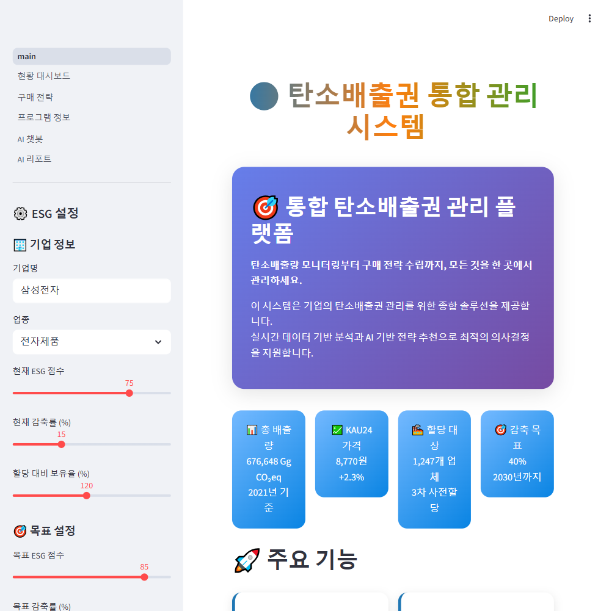
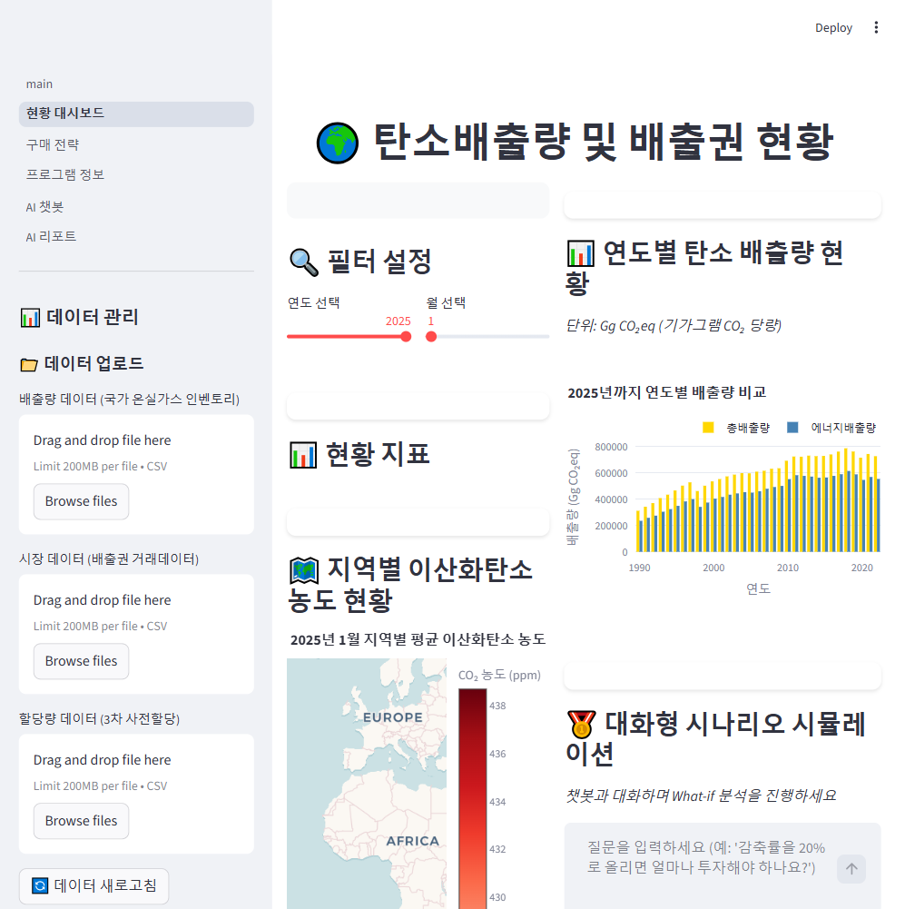
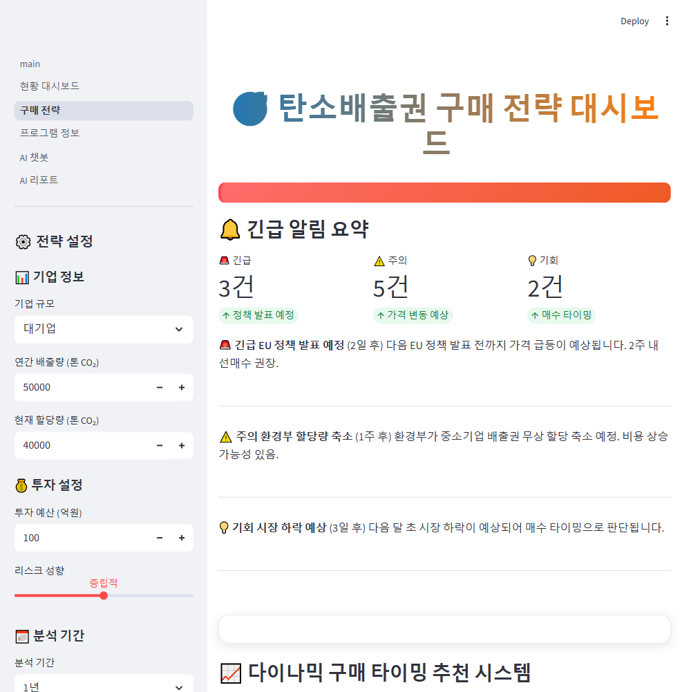
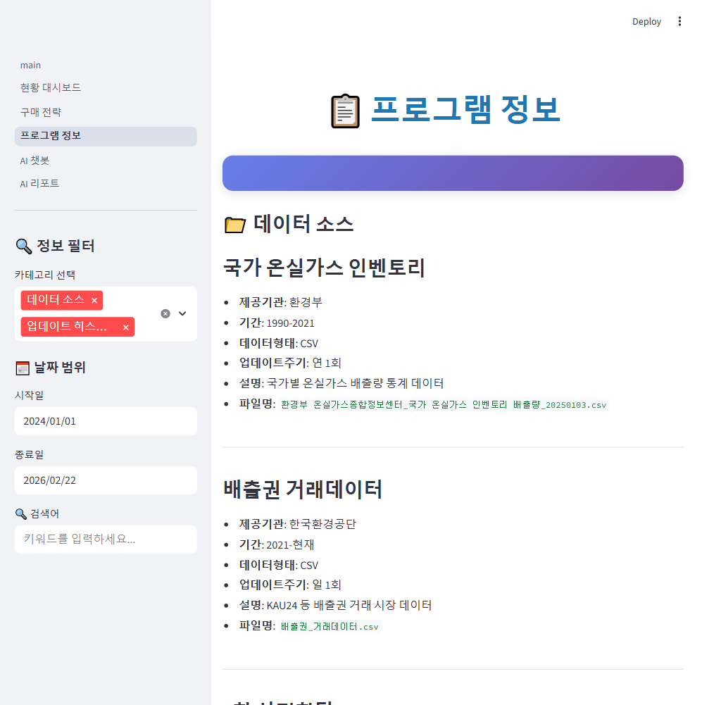
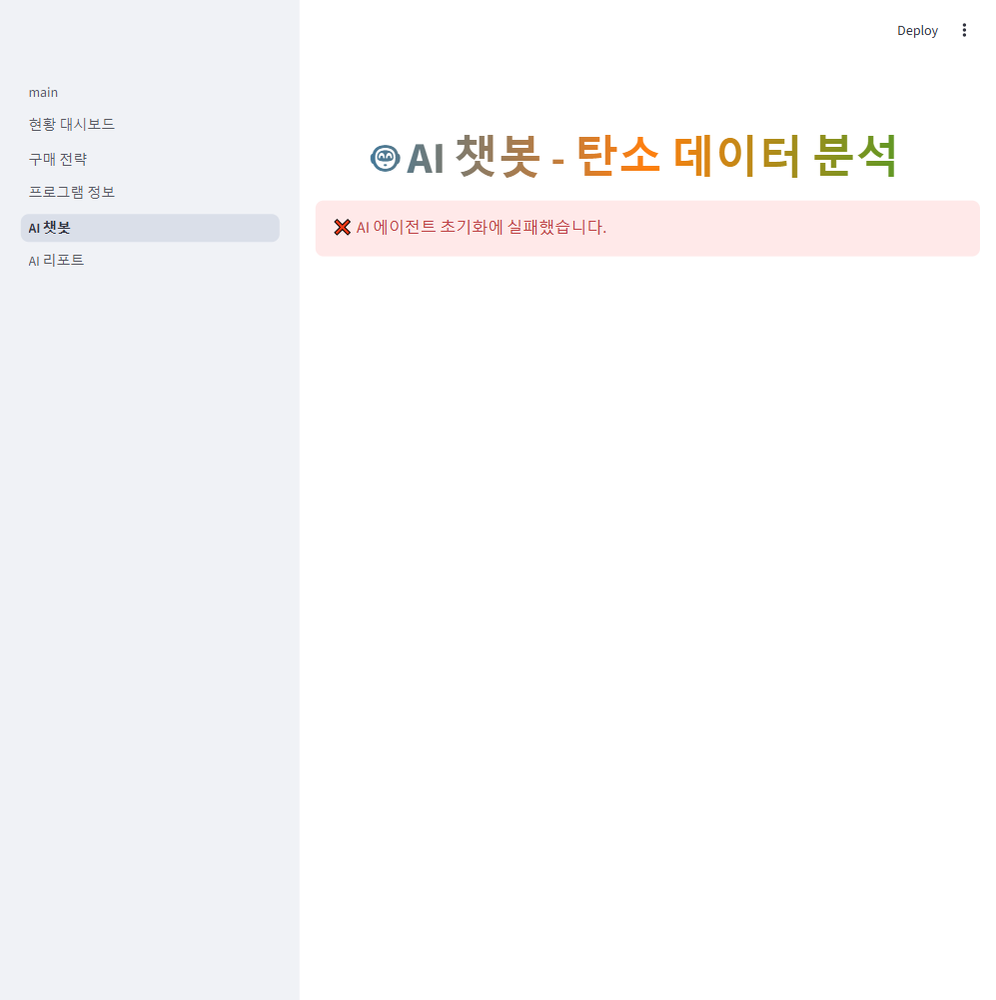
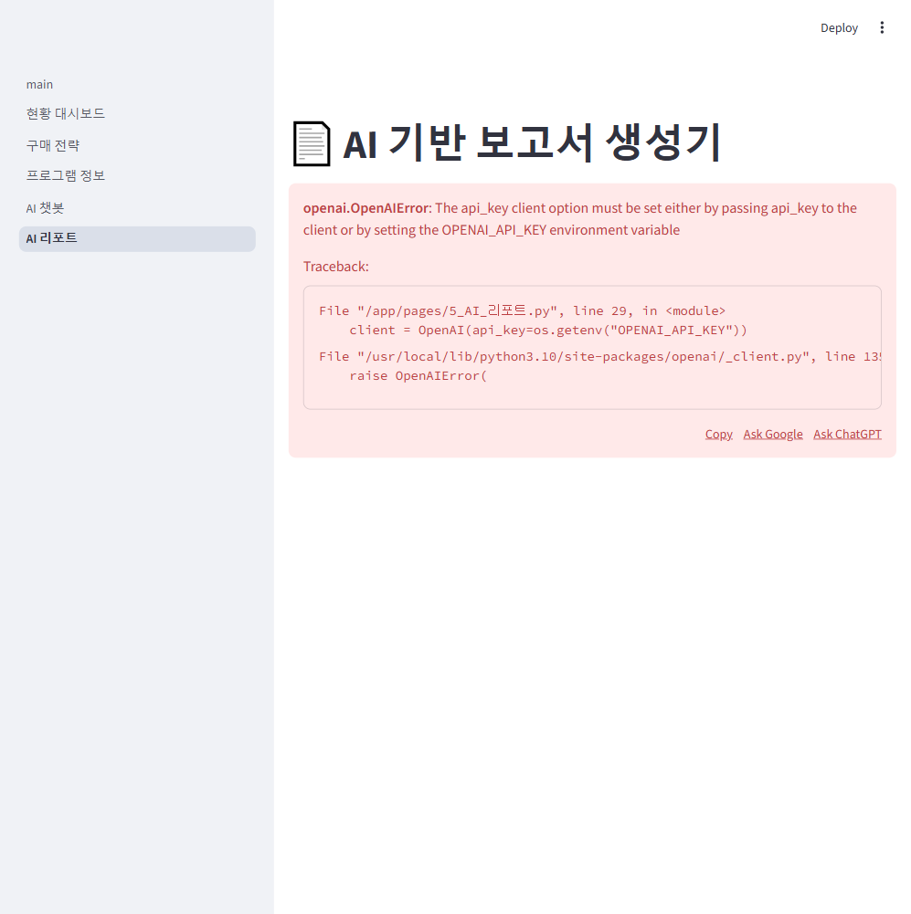

# K-ETS 탄소배출권 통합 관리 시스템

한국 탄소배출권거래제(K-ETS) 데이터를 기반으로 배출량 모니터링, 구매 전략 수립, AI 데이터 분석, 보고서 자동 생성까지 제공하는 풀스택 대시보드 시스템입니다.

## 구현 목표

| 목표 | 설명 |
|------|------|
| **배출량 현황 시각화** | 국가 온실가스 인벤토리, 배출권 거래 시장, 업체별 할당량을 인터랙티브 차트로 시각화 |
| **구매 전략 의사결정 지원** | 매수 타이밍 분석, 감축 vs 구매 ROI 비교, ETF/선물 헤징 전략 추천 |
| **AI 기반 데이터 분석** | LLM이 Python 코드를 자동 생성하여 CSV 데이터를 직접 분석하고 시각화 |
| **AI 보고서 자동 생성** | 주제 입력 → 목차 생성 → 섹션별 본문 스트리밍 → DOCX/PDF 다운로드 |
| **Docker 기반 배포** | 한 명령어로 Streamlit + FastAPI 두 서비스를 동시에 기동 |

## 구현 결과

### 메인 페이지 — ESG 랭킹 시스템
ESG 점수 기반 기업 랭킹, KPI 비교, 감축률 추세 차트, 배지 시스템을 제공합니다.



### 1. 현황 대시보드
연도별 배출량, 지역별 CO2 농도 지도, KAU24 시장 데이터, 업체별 할당량 분포를 확인할 수 있습니다.
내장된 시나리오 시뮬레이션 챗봇으로 What-if 분석이 가능합니다.



### 2. 구매 전략 대시보드
긴급 알림 시스템, 최적 매수 타이밍 추천, 감축 vs 구매 ROI 비교 차트, ETF/선물 헤징 포트폴리오를 제공합니다.



### 3. 프로그램 정보
데이터 출처, 업데이트 이력, 시스템 버전 정보를 확인할 수 있습니다.



### 4. AI 챗봇
LLM이 질문을 분석하여 Python 코드를 자동 생성, 실행한 뒤 결과와 시각화를 반환합니다.



### 5. AI 리포트
PDF 문서를 업로드하면 Pinecone에 벡터화하여 RAG 기반 보고서를 생성합니다.



## 기술 스택

| 분류 | 기술 |
|------|------|
| **프론트엔드** | Streamlit, Plotly, Matplotlib, Seaborn |
| **백엔드 API** | FastAPI, Uvicorn, Pydantic, SSE 스트리밍 |
| **AI/LLM** | LangChain, Upstage Solar LLM, OpenAI GPT-4, LangChain Hub |
| **Vector DB** | Pinecone (RAG 파이프라인) |
| **문서 처리** | Upstage Document Parse, pdfplumber, python-docx, ReportLab |
| **데이터** | Pandas, NumPy, 공공데이터 CSV/Excel |
| **인프라** | Docker, Docker Compose |
| **테스트** | pytest (204 tests) |
| **언어** | Python 3.10 |

## 빠른 시작 (Docker)

Docker가 설치되어 있다면 아래 3단계로 실행할 수 있습니다.

### 1. 프로젝트 클론

```bash
git clone https://github.com/Quietseong/K-ETS_Dashboard.git
cd K-ETS_Dashboard
```

### 2. 환경변수 설정

```bash
cp env.example .env
```

`.env` 파일을 열어 API 키를 입력합니다.

```dotenv
# 필수 (AI 챗봇/리포트 기능에 필요)
UPSTAGE_API_KEY=your_upstage_api_key_here
OPENAI_API_KEY=your_openai_api_key_here

# 선택
PINECONE_API_KEY=your_pinecone_api_key_here
```

> **참고**: API 키가 없어도 대시보드(메인, 현황, 구매전략, 프로그램정보)는 정상 작동합니다.
> AI 챗봇과 AI 리포트 페이지에서만 키 설정 안내가 표시됩니다.

### 3. Docker Compose 실행

```bash
docker compose up -d
```

빌드 완료 후 두 서비스가 기동됩니다:

| 서비스 | URL | 설명 |
|--------|-----|------|
| **Streamlit 대시보드** | http://localhost:8501 | 메인 UI |
| **FastAPI 보고서 API** | http://localhost:8000/docs | Swagger UI |

서비스 상태 확인:

```bash
docker compose ps
```

종료:

```bash
docker compose down
```

## 로컬 실행 (Docker 없이)

### 1. Python 가상환경 설정

```bash
# Python 3.10 이상 필요
python -m venv venv

# Windows (Git Bash)
source venv/Scripts/activate

# macOS / Linux
source venv/bin/activate
```

### 2. 의존성 설치

```bash
pip install -r requirements.txt
```

### 3. 환경변수 설정

```bash
cp env.example .env
# .env 파일을 열어 API 키 입력
```

### 4. 서비스 실행

**방법 A: 실행 스크립트 사용 (Windows)**

```bash
# CMD
run_dashboard.bat

# PowerShell
.\run_dashboard.ps1
```

**방법 B: 수동 실행**

터미널 2개를 열어 각각 실행합니다.

```bash
# 터미널 1 — Streamlit 대시보드
streamlit run main.py --server.port 8501

# 터미널 2 — FastAPI 보고서 API
python app_api.py
```

접속:
- 대시보드: http://localhost:8501
- API Swagger: http://localhost:8000/docs

## 프로젝트 구조

```
K-ETS_Dashboard/
├── main.py                 # Streamlit 메인 페이지 (ESG 랭킹)
├── app_api.py              # FastAPI 보고서 생성 서버
├── data_loader.py          # 통합 데이터 로더 (CSV 인코딩 자동 감지)
├── utils.py                # DOCX/PDF 파일 생성 유틸리티
│
├── agent/                  # AI 에이전트
│   ├── agent_template.py               # 보고서 템플릿/목차 생성
│   ├── enhanced_carbon_rag_agent.py    # 코드 생성 + RAG 분석 에이전트
│   ├── doc_agent.py                    # PDF 파싱 + Pinecone RAG
│   └── types.py                        # AgentResponse 타입 정의
│
├── pages/                  # Streamlit 멀티페이지
│   ├── 1_현황_대시보드.py   # 배출량/시장/할당량 시각화
│   ├── 2_구매_전략.py       # 매수 타이밍/ROI/헤징 전략
│   ├── 3_프로그램_정보.py   # 데이터 소스 및 업데이트 이력
│   ├── 4_AI_챗봇.py         # LLM 코드 생성 기반 데이터 분석
│   └── 5_AI_리포트.py       # PDF → Pinecone RAG → 보고서 생성
│
├── prompts/                # LLM 프롬프트 템플릿
│   ├── code_generation.py  # 질문→코드 생성 few-shot 프롬프트
│   └── interpretation.py   # RAG 답변 해석 프롬프트
│
├── data/                   # CSV/Excel 데이터 파일
├── docs/                   # PDF 참고문서
│
├── Dockerfile              # python:3.10-slim + 한글 폰트
├── docker-compose.yml      # streamlit(8501) + fastapi(8000)
├── .dockerignore
├── requirements.txt        # 프로덕션 의존성
├── requirements-dev.txt    # 개발 의존성 (pytest)
├── pyproject.toml          # pytest 설정
├── env.example             # 환경변수 템플릿
├── run_dashboard.bat       # Windows CMD 실행 스크립트
└── run_dashboard.ps1       # PowerShell 실행 스크립트
```

## API 엔드포인트

| 메서드 | 경로 | 설명 |
|--------|------|------|
| `GET` | `/` | API 상태 확인 |
| `POST` | `/generate-outline-from-topic` | 주제 → 보고서 목차 생성 |
| `POST` | `/generate-report` | 목차 → 본문 SSE 스트리밍 |
| `POST` | `/download-report` | 보고서 DOCX/PDF 다운로드 |

Swagger UI에서 직접 테스트: http://localhost:8000/docs

## 데이터 소스

| 데이터 | 출처 | 형태 |
|--------|------|------|
| 국가 온실가스 인벤토리 배출량 | 환경부 온실가스종합정보센터 | CSV |
| 배출권 거래데이터 (KAU24) | 한국환경공단 | CSV |
| 3차 사전할당 업체별 할당량 | 환경부 | CSV |
| 산업부문 에너지사용 및 온실가스배출량 | 한국에너지공단 | CSV |
| 기업 규모/지역별 온실가스 배출량 | 기상청/환경부 | Excel |

## 테스트

```bash
# 개발 의존성 설치
pip install -r requirements-dev.txt

# 전체 테스트 실행
pytest tests/ -v

# 특정 스테이지 테스트만 실행
pytest tests/test_data_loader.py -v
pytest tests/test_api.py -v
pytest tests/test_docker.py -v
```

현재 **204개 테스트** 통과:

| 테스트 파일 | 건수 | 검증 영역 |
|-------------|------|----------|
| `test_stage1_structure.py` | 23 | 프로젝트 구조, 불필요 파일 제거 |
| `test_data_loader.py` | 16 | 데이터 로더 인코딩/파싱 |
| `test_api.py` | 38 | FastAPI 엔드포인트, Pydantic 모델 |
| `test_agent_interfaces.py` | 28 | AgentResponse 타입, 에이전트 인터페이스 |
| `test_pages.py` | 17 | 페이지 구조, 번호 정합성 |
| `test_docker.py` | 71 | Docker 설정, 의존성 정리 |
| `test_ui_improvements.py` | 11 | API 키 에러 핸들링, deprecation |

## 외부 서비스 API 키 안내

| 서비스 | 용도 | 발급처 |
|--------|------|--------|
| **Upstage** | Solar LLM, Document Parse, Embeddings | https://console.upstage.ai |
| **OpenAI** | GPT-4 (대체 LLM), text-embedding-3-small | https://platform.openai.com |
| **Pinecone** | 벡터 DB (RAG 파이프라인) | https://www.pinecone.io |

> LLM은 Upstage API 키를 우선 사용하며, 없을 경우 OpenAI로 자동 전환됩니다.

## 라이선스

이 프로젝트는 학습 및 포트폴리오 목적으로 제작되었습니다.
